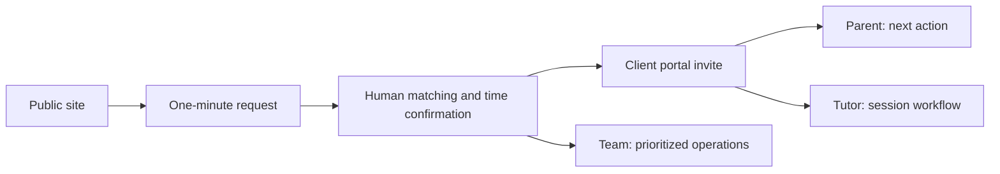

# Complete Website UX Simplification Audit and Design

**Date:** 2026-08-01
**Status:** Recommended design for implementation handoff
**Scope:** Public website, request flow, client sign-in, parent portal, tutor portal, owner/team console, visual system, motion, accessibility, performance, and code organization.

## Executive verdict

The concern is correct: the product is overcharged. The visual identity is strong, the copy is empathetic, and the system contains valuable features, but too many of those features compete for attention at the same time.

This is primarily an information-architecture problem, not a color or spacing problem. The current pattern is to add another card, metric, form, or list whenever a capability is introduced. That worked while the product was small. It now produces long marketing pages, repeated calls to action, and role dashboards that expose most of the system at once.

The recommended direction is a **task-centered redesign with progressive disclosure**:

- Keep the current navy/gold brand, business rules, APIs, bilingual content, and secure portal behavior.
- Give every screen one clear purpose and one dominant next action.
- Move low-frequency information into drill-down views instead of stacking it below the primary workflow.
- Give parent, tutor, and team users separate navigation models even though they use the same underlying data.
- Reduce decorative cards and motion; reserve emphasis for actions, deadlines, and status changes.
- Split the portal code by role so future features do not automatically make every dashboard larger.

## How the audit was performed

The audit combined:

- responsive visual inspection of the running local site at desktop and 390 × 844 mobile sizes;
- DOM and content-density measurements for the main public journeys;
- review of route structure, dashboard composition, portal selectors, tests, generated bundles, and recent design/implementation documents;
- a role-by-role walkthrough as a stressed parent, a working tutor, the owner, and a future team member.

Authenticated dashboards were audited from their complete React composition and data contracts because no production parent, tutor, or operator credentials were used. The public tutor page showed its API-unavailable fallback in the frontend-only local runner; production availability must be checked separately.

## What already works and should be preserved

1. **The brand is recognizable.** Navy, warm gold, the logo, and the display type create a serious but supportive tutoring brand.
2. **The core parent promise is good.** The site speaks to the emotional reality of school stress without blaming the student or parent.
3. **The request model is reassuring.** A parent can start without an account or payment, and the team confirms fit before commitment.
4. **Pricing is transparent.** Session counts, totals, per-session prices, installments, and the absence of automatic renewal are stated.
5. **The parent portal has useful state logic.** It already computes one next action and separates current, follow-up, past, and cancelled sessions.
6. **The portal protects important workflows.** Confirmation, payment, material sharing, tutor assignment, and session state are not merely decorative UI.
7. **The site is bilingual and route-lazy-loaded.** Search-focused pages do not all enter the initial page component at once.
8. **Accessibility foundations exist.** Focus rings, 44 px targets, labels, reduced-motion CSS, and meaningful landmarks are present in many places.
9. **The recent four-destination parent navigation was the right first move.** The remaining problem is the density inside those destinations, especially Account.

## Evidence of overload

### Public-page density at mobile size

| Page | Main words | H1–H3 headings | Page height | Approx. 844 px screens |
| --- | ---: | ---: | ---: | ---: |
| Home | 746 | 15 | 9,077 px | 10.8 |
| Request | 224 | 5 | 3,305 px | 3.9 |
| Math | 650 | 10 | 9,201 px | 10.9 |
| Science | 633 | 10 | 9,327 px | 11.1 |
| Our approach | 473 | 9 | 6,633 px | 7.9 |
| Parent journey | 425 | 5 | 5,397 px | 6.4 |
| Tutor profiles | 187 | 3 | 3,893 px | 4.6 |
| Become a tutor | 693 | 19 | 9,539 px | 11.3 |

Long pages are not automatically bad, especially for search content. The problem is that the conversion pages repeat the same ideas and actions while presenting most sections with equal visual weight.

### Dashboard and code density

- `src/pages/Portal.jsx` is 7,298 lines and about 321 KB. It contains authentication, copy, all three role dashboards, most forms, records, state presentation, and utility functions.
- The parent **Today** view renders next action, next session, materials, progress, and metrics. The **Account** view can render approximately twelve separate panels or lists.
- The tutor dashboard renders metrics, next session, materials, all sessions, calendar, availability, note form, messages, a request form, past notes, parent feedback, and request history in one two-column page.
- The operator dashboard renders two overlapping priority boards followed by metrics, parent creation, parent management, tutor management, plan enrollment, scheduling, test-data cleanup, sessions, feedback, messages, and requests.
- The operator payload includes broad collections for parents, tutors, up to 100 sessions, feedback, messages, payments, plans, credit ledger, queues, and automation state before the operator chooses a task.
- Existing generated assets include an approximately 457 KB main JavaScript file, 247 KB portal chunk, and 116 KB motion-related chunk before transfer compression. Route splitting is good, but the portal and motion cost can be reduced further.

## Highest-priority findings

### P0 — Repair before the redesign

1. **Broken request links exist.** Tutor-profile and case-study calls to action point to `/#demande`, but the current home page has no `demande` target. They should point to `/demande` or `/en/request`.
2. **Mobile repeats one action too aggressively.** On the home, request, tutor-profile, and recruitment journeys, the header action, in-page action, and sticky bottom action can all point to the same destination in one viewport.
3. **The request page advertises the request while the request is already underway.** Its sticky bottom button links to the current page and covers part of the form viewport. Hide the global sticky action on request and thank-you routes.
4. **Public client sign-in exposes an internal role.** Parent, Tutor, and Team are presented as equal choices. Move Team sign-in to a separate unlisted route and keep the public portal focused on clients.
5. **The sign-in screen shows both code-request and code-verification forms before a code exists.** Make it a two-step flow: email first, code second.
6. **The tutor-profile fallback can become a trust failure.** If profiles cannot load, show a stable, useful explanation and a working request action; do not leave the parent on a page whose main promise is unavailable.

### P1 — Rebuild the role experiences

1. Replace stacked dashboards with role-specific application shells.
2. Keep one dominant task above the fold and move secondary records behind navigation or drill-down.
3. Replace repeated cards with compact rows, grouped timelines, filters, and detail panels.
4. Separate operator work from operator administration.
5. Split `Portal.jsx` by copy, shared primitives, and role views so each role can evolve independently.

### P2 — Simplify the public site and system polish

1. Reduce main navigation from seven equally weighted links to four primary destinations plus portal and request actions.
2. Shorten conversion pages and remove duplicated forms/actions.
3. Reduce glass-on-glass styling, oversized corner radii, tiny low-opacity labels, and decorative icons.
4. Replace broad card hover animation with a restrained motion system tied to state and navigation.
5. Add measurement for task completion rather than page clicks alone.

## Recommended strategy and alternatives

### Recommended: task-centered restructuring

Keep the backend contracts and business logic, but reorganize the frontend into focused role views and simplified marketing templates. This delivers meaningful improvement without a risky platform rewrite.

**Trade-off:** More work than a style pass, but it solves the real problem and can be released role by role.

### Alternative 1: cosmetic reduction only

Reduce padding, shorten copy, hide a few cards, and tone down animation inside the current page structure.

**Trade-off:** Cheapest and fastest, but the parent Account view, tutor page, team console, and monolithic portal code remain hard to use and hard to extend.

### Alternative 2: new application and backend

Rebuild the portal as a separate product with a new database, dedicated admin framework, and redesigned APIs.

**Trade-off:** Cleanest long-term architecture, but highest cost and migration risk. The current business volume and unvalidated workflow do not justify this first.

## Public website audit and target design

### Navigation

Current desktop navigation tries to expose Home, Math, Science, Approach, Parent journey, Portal, Tutor recruitment, language, and request action at once. It is visibly crowded.

Use this hierarchy:

- Primary: **Maths**, **Sciences**, **Comment ça marche**, **Tarifs**.
- Utility: **Espace client** and language.
- Primary action: **Demander une séance**.
- Footer/menu-only: Tutors, parent stories, resources, blog, locations, and become a tutor.

Search landing pages remain indexed and internally linked. They do not need equal placement in the main navigation.

### Home page

The current page has five broad ideas, but several are repeated: the hero contains a three-step process, the next section asks the parent to self-identify, operational promises repeat the reassurance, pricing repeats decision framing, and calls to action appear throughout.

Target mobile order:

1. **Hero:** one promise, one price anchor, one request button, one quiet phone link.
2. **Proof strip:** three concrete promises such as response timing, matched tutor, and post-session recap.
3. **How it works:** three short steps; move the current hero-side process here.
4. **Pricing:** three formats with one recommended starting point; no repeated request button inside every paragraph.
5. **Parent proof:** one or two genuine outcomes or a transparent “what you will receive” example.
6. **FAQ and final action.**

Remove the three large situation cards from the home page. The request form already asks about the situation, and search landing pages already serve specific intents. If retained, convert them to three compact choice chips that prefill the request instead of three full cards with two links each.

Target: no more than six mobile-screen lengths, about 450–550 main words, and one dominant action per viewport.

### Request flow

The form itself is sensible. The lead-in is too tall on mobile, so the form begins after a complete explanatory screen.

Target flow:

- Keep badge, concise title, one sentence, and price above the form.
- Move “what happens next” below the form or into a collapsed reassurance row.
- Show the first input within the first mobile viewport.
- Keep the form grouped into Contact, Student need, and Availability.
- Use a single submit action and a short privacy sentence.
- Hide global request actions on this route.
- On success, show response-time expectation, what the team will do, and one optional “prepare details” link. Do not immediately sell another path.

### Math and science pages

These pages are each roughly eleven mobile screens and contain embedded forms in addition to global actions.

Keep their search intent, but use one reusable subject template:

1. Subject-specific promise and request action.
2. Problems covered.
3. How a session works.
4. Relevant levels/topics.
5. One proof/FAQ block and final action.

Remove embedded full lead forms from subject pages. Send the parent to the single request experience with the subject preselected. This lowers maintenance, removes duplicate form behavior, and produces consistent analytics.

### Tutor profiles

- Repair request destinations.
- Lead with the matching method, then show real, consented profiles.
- If no profiles are published, say that profiles are shared after the need is reviewed and link directly to the request form.
- Remove self-referential copy such as “the good site does not tell everything.” Speak about the service, not the website.
- Avoid a primary phone action and a separate form action when the standard path is a short request. Use request as primary and phone as urgent-only.

### Tutor recruitment

The recruitment page is one of the longest pages and repeats candidature, mission, qualities, process, application, standards, FAQ, and final pitch. The candidate form appears before practical employment information.

Target order:

1. Role summary and practical facts: subjects, online/in-person, location, expected availability, and compensation starting at the current 28 CAD/hour policy with adjustment language.
2. What the tutor does before, during, and after a session.
3. Requirements and selection process.
4. Short application form.
5. Focused FAQ.

Remove brand self-praise, repeated “clarity/rigour/impact” paragraphs, duplicate application sections, and repeated sticky/in-page actions. Target six mobile-screen lengths and approximately 450 words before FAQ content.

### Public assistant and mini-assessment

The floating assistant combines canned chat responses, quick actions, and a diagnostic drawer. It adds another decision surface to pages that already contain calls to action.

Recommendation:

- Remove the floating chat trigger from the default public journey.
- Keep the useful two-minute diagnostic as **Aidez-moi à choisir** on the request page or as one optional hero text link.
- Do not present a bot unless it solves a measured question better than the request form or FAQ.
- If chat returns later, label its limitations plainly and measure whether it increases completed requests.

## Parent experience

### Parent mental model

A parent generally asks four questions:

1. What happens next?
2. When is the next session, with whom, and how do we prepare?
3. What happened last time?
4. Do I need to pay, reply, or change anything?

The portal should answer these before showing totals, histories, enrollment concepts, or management forms.

### Parent navigation

Keep four destinations but change what they contain:

- **Accueil:** next action, next session, and latest recap only.
- **Séances:** upcoming/past segmented list, book/reschedule actions, and session detail.
- **Messages:** session threads and unread state.
- **Plus:** Family, tutor, plan, billing, and preferences as compact rows leading to detail views.

Use a desktop side navigation and a mobile bottom navigation. The current 2 × 2 button grid consumes space at the top of every parent destination and disappears when the user scrolls.

### Parent home

Remove the metric strip. Counts such as total leads, total notes, and total sessions describe the database rather than the parent’s immediate job.

The home state should be derived from the next session and next action:

- **Needs attention:** payment, confirmation, reply, or preparation.
- **Ready:** next session with tutor, date, format, and relevant material state.
- **After a session:** latest released recap and one next step.
- **Waiting for matching:** a calm status and response expectation, not empty cards.

Only one large gold action appears. Secondary actions are text links or an overflow menu.

### Sessions

- Default to Upcoming; place Past behind a segment.
- Show one compact row per session: date/time, student, tutor, status, and one contextual action.
- Open a detail panel for confirmations, materials, recap, Meet link, change request, and payment.
- Move package payment and credit management to Billing. A session may link to the relevant payment, but Sessions should not become an accounting page.
- Replace “credits” in parent copy with **séances restantes** unless the exact ledger is legally or operationally necessary.

### Messages

- Replace the generic message panel plus full activity timeline with conversation threads grouped by session or student.
- Show unread/reply-needed first.
- Keep system activity such as payment created or material uploaded inside the relevant session timeline, not as a second inbox.

### Family, plan, and billing

The current Account destination is a page dump. Replace it with a list:

- Student and assigned tutor
- Plan and sessions remaining
- Billing and receipts
- Family details
- Feedback and help

Each row opens one focused detail view. Editing should be explicit; do not render all forms in edit mode by default.

## Tutor experience

### Tutor mental model

A tutor needs to know:

1. What is my next session?
2. What should I review before it?
3. Which note or reply is due?
4. What is my schedule and availability?

The current page gives equal weight to history, metrics, feedback, requests, and availability management before the tutor chooses a task.

### Tutor navigation

- **Aujourd’hui:** next session, materials, join link, and notes/replies due.
- **Horaire:** calendar, availability, and upcoming sessions.
- **Élèves:** active students, goals, recent sessions, and notes.
- **Messages:** parent/team threads.
- Profile/preferences can live under an avatar menu rather than a fifth primary destination.

### Tutor home

- Replace the metric strip with at most two attention chips: **notes à remettre** and **messages à répondre**.
- Make the next-session card stateful: Prepare → Join → Write recap.
- Show parent materials inside that session card, not in a separate dashboard-wide panel.
- If a note is overdue, it becomes the first card and the note form opens for the correct session.
- Parent feedback belongs in the relevant student or profile area, not the main work queue.

### Schedule and availability

- Calendar is the default view; availability management is a secondary mode.
- Present recurring windows as compact rows with edit/pause controls.
- Add one clear **Ajouter une disponibilité** action that opens a form; do not keep the creation form permanently expanded below the list.

### Students and notes

- Derive a student directory from assigned sessions initially; add a dedicated API only if scale requires it.
- A student detail shows learning context, upcoming session, materials, prior tutor notes, and parent-approved feedback.
- The tutor writes a structured recap from the session detail. Do not place a general note form on the dashboard without a selected session.

## Owner and team experience

### Owner mental model

The owner needs both daily execution and business oversight, but not on the same screen.

- **Daily execution:** callbacks, matching, confirmations, calendar problems, missing notes, messages, and payments.
- **Business oversight:** leads, conversion, active families, tutor capacity, revenue/payment status, ratings, and plan utilization.

### Team navigation

- **Aujourd’hui:** one prioritized task queue and today's calendar.
- **Familles:** search, family record, students, tutor assignment, plan, and history.
- **Tuteurs:** roster, capacity, availability, access, rates, and public profile.
- **Calendrier:** schedule, confirm, reschedule, cancel, and Meet state.
- **Paiements:** payment requests, overdue items, plans, and receipts.
- **Boîte de réception:** parent/tutor messages and requests.
- **Réglages:** access administration, automation status, and test-data cleanup.

### Team home

Merge TodayBoard and TeamPriorityBoard. Calls and confirmations currently appear in both mental models. Use one sorted queue with:

1. blocking errors and sessions happening soon;
2. parent callbacks and matching;
3. confirmations and calendar issues;
4. notes/messages past their service target;
5. payments due.

Each item needs owner, deadline, entity, status, and one direct action. “Automation runs every 15 minutes” belongs in Settings, not the daily dashboard.

### CRM and scale

- Add global search by parent, student, tutor, email, or phone.
- Replace giant select controls and unbounded record stacks with searchable lists, filters, and pagination.
- Keep create actions behind **Ajouter** buttons or drawers.
- Move test-data cleanup out of the normal work column.
- Separate team permissions so finance, destructive cleanup, tutor rates, and access administration can be restricted later.

The first UI phase may filter the existing operator payload client-side. The scaling phase should split the operator API into summary and paginated collection requests so opening Today does not fetch the entire CRM.

## Target information architecture

```mermaid
flowchart TD
  P["Parent portal"] --> PH["Home: act, prepare, recap"]
  P --> PS["Sessions: upcoming, past, detail"]
  P --> PM["Messages: threads"]
  P --> PX["More: family, tutor, plan, billing"]

  T["Tutor portal"] --> TH["Today: next session and work due"]
  T --> TS["Schedule: calendar and availability"]
  T --> TU["Students: context and notes"]
  T --> TM["Messages: parent and team threads"]

  O["Team console"] --> OT["Today: one priority queue"]
  O --> OF["Families"]
  O --> OR["Tutors"]
  O --> OC["Calendar"]
  O --> OP["Payments"]
  O --> OI["Inbox"]
  O --> OS["Settings"]
```





## Visual plan

### Brand direction

Preserve the current navy and warm gold. The redesign should feel calmer, not generic.

- Use one base background and one elevated surface per screen.
- Reserve gold for the primary action, urgent attention, and current progress—not all three at once.
- Use cards only for objects a person can act on: a session, message thread, family, tutor, or priority.
- Render repeated records as rows with separators rather than separate glowing cards.
- Limit corner radii to a small system: 16 px controls, 20 px cards, 24 px hero/major panels.
- Reduce background glows, noise, inset borders, and nested translucent panels.
- Keep body copy at full readable contrast. Avoid `text-white/35`–`text-white/45` for small essential labels.
- Use display type for page titles only; use the sans serif for task headings and data.
- Use one icon per object or action, not one icon for every label.

### Parent mobile wireframe

```text
┌─────────────────────────────────┐
│ Méthode                 Profil  │
├─────────────────────────────────┤
│ Bonjour Marie                    │
│ Prochaine étape                  │
│ ┌─────────────────────────────┐ │
│ │ Séance jeu. 17 h · Alex     │ │
│ │ David · En ligne            │ │
│ │ [Préparer la séance]        │ │
│ │ Détails · Modifier          │ │
│ └─────────────────────────────┘ │
│ Dernier bilan                    │
│ Fractions mieux comprises…  >   │
├─────────────────────────────────┤
│ Accueil  Séances  Messages  Plus│
└─────────────────────────────────┘
```

### Tutor mobile wireframe

```text
┌─────────────────────────────────┐
│ Aujourd'hui                      │
│ 1 note à remettre · 1 message   │
│ ┌─────────────────────────────┐ │
│ │ 17 h · Alex · Maths sec. 4  │ │
│ │ 2 documents parent          │ │
│ │ [Ouvrir la préparation]     │ │
│ └─────────────────────────────┘ │
│ Cette semaine                    │
│ Mar 17 h Alex                 > │
│ Jeu 18 h Sam                  > │
├─────────────────────────────────┤
│ Aujourd'hui Horaire Élèves Msgs │
└─────────────────────────────────┘
```

### Team desktop wireframe

```text
┌──────────────┬──────────────────────────────────────────┐
│ Aujourd'hui  │ Aujourd'hui · 7 éléments à traiter       │
│ Familles     │ [Urgent 2] [Avant midi 3] [Plus tard 2] │
│ Tuteurs      │                                          │
│ Calendrier   │ 09:00  Appeler Parent A        [Ouvrir] │
│ Paiements    │ 10:30  Confirmer séance B      [Ouvrir] │
│ Boîte        │ 13:00  Trouver tuteur C        [Ouvrir] │
│ Réglages     │                                          │
│              │ Calendrier du jour                       │
└──────────────┴──────────────────────────────────────────┘
```

## Motion and animation plan

Motion should explain hierarchy, feedback, and continuity. It should not make every card feel interactive.

### Motion tokens

| Token | Value | Use |
| --- | --- | --- |
| Instant | 100–120 ms | hover color, pressed state |
| Quick | 160–180 ms | tabs, drawers, compact expand/collapse |
| Standard | 220–240 ms | page content transition, detail panel |
| Emphasis | 280–320 ms | successful completion or first reveal only |
| Ease out | `cubic-bezier(0.22, 1, 0.36, 1)` | elements entering or expanding |
| Ease in/out | `cubic-bezier(0.4, 0, 0.2, 1)` | elements changing in place |

### Choreography by interaction

| Moment | Animation | Constraint |
| --- | --- | --- |
| First page load | title and primary action fade/translate 8 px over 220 ms | No large section-by-section scroll spectacle |
| Navigation change | old content fades 80 ms; new content fades/raises 8 px over 180 ms | Keep navigation stationary |
| Mobile bottom navigation | active icon background and label transition over 160 ms | No bouncing icons |
| Detail drawer | slide from the side on desktop, bottom sheet on mobile, 220 ms | Focus moves into panel; Escape closes |
| Expand a record | height and opacity over 180 ms | Do not animate entire page position for longer than 240 ms |
| Save or upload | inline progress; row changes to a check state over 240 ms | Never use an endless celebratory animation |
| Payment/confirmation success | one gold-to-green highlight and check over 300 ms | Runs once, then settles |
| Error | reveal message and focus it; optional 2 px nudge once | No repeated shake |
| Sticky mobile action | slide up 12 px when the original action leaves view | Never display on request, portal, or thank-you routes |
| Card hover | only interactive cards rise 2 px over 120 ms | Static cards do not move |
| Loading | stable skeleton blocks or spinner in the affected action | Keep page structure stable |

### Reduced-motion behavior

For `prefers-reduced-motion: reduce`:

- remove translation, stagger, spring, shimmer, and smooth scrolling;
- use immediate content replacement or a short opacity change under 100 ms;
- keep progress and success states understandable without animation;
- never make motion the only signal that data or navigation changed.

### Motion implementation recommendation

The current `MotionCard` imports Framer Motion even when a card is non-interactive. Replace generic card movement with CSS transitions and Radix's existing state animations. Keep a motion library only if a later workflow proves it is needed for coordinated layout transitions. This should reduce JavaScript while making motion more intentional.

## Accessibility improvements

1. Test small labels and metadata at WCAG AA; raise the opacity of essential `white/35` and `white/45` text.
2. Keep at least 44 × 44 px touch targets and visible focus rings.
3. Make role navigation persistent and expose `aria-current` on the active destination.
4. Use actual dialog/drawer semantics for focused editing and return focus to the opener.
5. Add live regions for code sent, upload progress, save success, payment state, and errors.
6. Do not rely on color alone for overdue, paid, confirmed, paused, or current states.
7. Keep destructive team actions behind confirmation that names the exact parent, tutor, session, or test record.
8. Keep heading levels sequential; the recruitment page currently has 19 H1–H3 headings and should be simplified structurally as well as visually.
9. Use plain French parent terms instead of exposing internal statuses or English-like humanized values.
10. Verify keyboard, screen-reader, 200% zoom, and reduced-motion flows for all four primary tasks per role.

## Content and trust improvements

- Say what happens next once, then let the interface demonstrate it.
- Replace repeated claims about clarity with concrete evidence: response time, tutor match criteria, recap format, cancellation policy, and what the parent receives.
- Do not describe the website as credible or well designed inside customer-facing copy.
- Use one consistent name for the first service: **séance ciblée** or **première séance**, not both in every section.
- Use **séances restantes** for parents; keep **credits** for internal ledgers only.
- State tutor compensation, relationship/contract expectations, response time, and weekly commitment clearly on the recruitment page.
- Distinguish urgent phone contact from the standard request path.
- Never imply a tutor opened a material unless the system tracks that event.

## Code and data architecture

The frontend redesign should leave business rules in pure libraries and make `Portal.jsx` an authenticated router rather than the entire application.

Target boundaries:

- `src/lib/portalCopy.js`: localized portal copy.
- `src/lib/portalNavigation.js`: role destinations and route keys.
- `src/lib/parentPortal.js`, `tutorPortal.js`, `operatorPortal.js`: pure view-model selectors.
- `src/components/portal/shared/`: shell, page header, status, session row, list, empty/error states.
- `src/components/portal/parent/`: four parent views and focused details.
- `src/components/portal/tutor/`: four tutor views and focused details.
- `src/components/portal/operator/`: Today, Families, Tutors, Calendar, Payments, Inbox, Settings.
- `src/pages/Portal.jsx`: session restoration, authentication flow, dashboard fetch, error boundary, and role routing only.

Target `Portal.jsx` size: under 500 lines after extraction. Target each role view: under 350 lines. Reuse pure selectors rather than duplicating session-state logic in JSX.

For the operator scaling phase, add summary and paginated collection APIs. Parent and tutor dashboards can continue using their current bounded payloads unless measurements show a problem.

## Measurement plan

### Public journey

- request action seen → request started → request submitted → request accepted;
- subject/offer preselection;
- validation error by field;
- urgent phone use;
- diagnostic opened → recommendation selected → request started.

### Parent

- sign-in code requested → verified;
- next action shown → opened → completed;
- session prepared, payment completed, confirmation completed, recap opened;
- messages requiring reply and time to reply.

### Tutor

- next-session preparation opened;
- material opened;
- session note due → started → submitted;
- availability window created/paused;
- reply-needed message completed.

### Team

- priority item opened → resolved;
- time to find a family/tutor;
- time to schedule and confirm a session;
- queue age by category;
- operator payload size and time to interactive.

Do not set conversion-improvement percentages before a baseline exists. First record two weeks of baseline data, then establish targets.

## Acceptance criteria

### Global

- One dominant action per viewport.
- No request CTA links to the current request page.
- No `#demande` link remains unless an element with that exact ID exists.
- Public desktop navigation fits comfortably at 1280 px without compressed labels.
- Reduced motion, keyboard navigation, and 200% zoom remain usable.

### Parent

- Next action and next session are visible without scrolling at 390 × 844.
- A common task takes no more than two destination changes/taps before the focused action.
- No metrics, complete history, feedback form, or account edit form appears on Home.
- Billing, family, and plan information open as separate focused details.

### Tutor

- Next session and notes/messages due are visible without scrolling.
- Materials are attached to the relevant session.
- Availability creation is collapsed until requested.
- Historical notes, feedback, and requests do not compete with today's work.

### Team

- Today has one deduplicated priority queue.
- Family and tutor records are searchable.
- Test cleanup and automation details live under Settings.
- Opening Today does not render every form and record list.
- The scaling phase paginates broad CRM collections.

### Public site

- Home and recruitment pages are no more than about six mobile-screen lengths at 390 × 844.
- The request form begins within the first mobile viewport.
- Subject pages use the shared request form rather than embedding duplicate forms.
- Tutor and case-study request links reach the localized request route.

## Release order

1. Repair broken/redundant actions and simplify sign-in.
2. Build the shared portal shell and parent experience.
3. Build the tutor workflow.
4. Reorganize the team console; then paginate operator data.
5. Simplify public pages and recruitment.
6. Apply the visual/motion system, accessibility pass, analytics, and performance budgets.

Each phase must be releasable and reversible on its own. Do not combine the portal information-architecture change with a backend migration.
